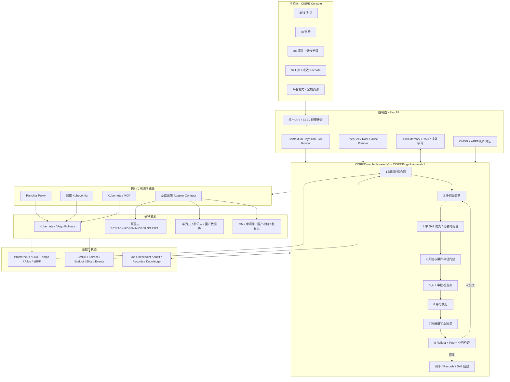

# CISRE 技术架构与可扩展设计

> CISRE（Cloud Infrastructure Site Reliability Engine）是一套面向 Kubernetes、云资源、数据库、虚拟机、中间件和存储的智能可靠性控制面。模型负责理解证据、提出假设与动态选择 Skill；确定性 Harness 负责状态、权限、审批、执行、回读和恢复判定。

## 总体架构图

## 为什么实际变更现在能够被证明

以前 Kubernetes API 返回 2xx 就会形成 `completed` 回执。这只能证明请求被 API 接收，不能证明它写入了正确集群、正确 Deployment，也不能证明补丁字段真实持久化。

当前每项 Workload 变更采用以下事务式证据链：

1. 使用即将执行变更的同一传输通道读取目标对象，记录 UID、resourceVersion 和 generation。
2. 固化本轮审批后的完整 Patch；时间戳和默认字段只生成一次，避免执行与验证使用不同载荷。
3. 按目标集群类型选择 Rancher、加密 kubeconfig 或本地 MCP 执行。
4. API 返回后，仍通过同一通道重新读取同一 UID 的对象。
5. 对审批 Patch 做递归逐字段比对，并验证 resourceVersion 是否前进。
6. 写后条件不满足时，本轮标记为失败，不进入“已提交成功”的假闭环。
7. 再等待 controller observedGeneration、rollout、新 Pod Ready、日志/Events 和业务探针稳定。

这套机制同样支持幂等：如果实时对象已经等于审批 Patch，则记录 `already_applied`，不会重复滚动 Workload。

## Harness 技术融合

CISRE 没有把通用 Coding Agent 的 Shell 自治直接搬进生产集群，而是吸收其成熟运行时能力，并用 SRE 风险边界重写：

| 前沿能力 | CISRE 落点 | SRE 限制 |
|---|---|---|
| 持久任务 / Todo / mode | `CISREDurableHarness/v3` 的 phase contracts、typed events、todos、checkpoint、resume token | 只能按证据→根因→变更→验证推进 |
| Everything is a Plugin | `CISREPluginHarness/v1` 的作用域服务、四类事件、可逆 Effect 和依赖激活 | Planner、Skill、审批、执行、回读、验证都可独立替换且不绕过门禁 |
| DeepSeek Harness 兼容 | 官方架构同构插件层；上游 Python SDK/JSON-RPC 仅预留为可选 Planner | 上游运行时不持有 Kubernetes 写权限，Developer Preview 不替换现有执行面 |
| Tool loop | 动态 Skill 与受控 action catalog | 模型不能创造未注册动作 |
| Human interrupt/resume | 审批检查点、approval ledger、等待时释放执行槽 | 所有变更默认需要本人确认 |
| Durable execution | Job Store、事件账本、attempt/receipt ledger | 副作用必须幂等且可回读 |
| Context compaction | 有界事件、模型调用、回执与尝试窗口 | 原始证据保留在记录，模型上下文只装载相关片段 |
| Loop evaluator | RecoveryVerifier + Skill success criteria | 只有实时恢复证据可以结束，不接受模型自报完成 |
| Skills progressive loading | Skill Router 先选单一主 Skill，证据需要时再组合 | 防止一次调用大量 Skill、统计失真 |
| Eval / observability | Skill 成功率、解决问题数、失败阶段、审计与追踪 | 按故障链去重，不按 UI 轮询次数计数 |

采用依据包括：

- Microsoft Agent Framework Harness：工具循环、逐调用历史持久化、压缩、Todo、模式、审批、OTel、Skills 与 completion evaluator。
- LangGraph：带 checkpointer 的 interrupt/resume，以及副作用必须幂等的恢复规则。
- Temporal：长任务在进程、网络或主机故障后从确定位置恢复的 durable execution 思想。
- Anthropic：简单可组合 workflow、路由、evaluator-optimizer，以及每一步从环境读取 ground truth。
- DeepSeek 官方 Agent 生态：OpenAI-compatible 模型适配、MCP、Skills、Hooks 与不同 Harness 的可插拔组合。

设计参考：

- [Microsoft Agent Framework Harness](https://learn.microsoft.com/en-us/agent-framework/agents/harness)
- [Microsoft Agent Framework Durable Extension](https://learn.microsoft.com/en-us/agent-framework/integrations/durable-extension)
- [LangGraph Interrupts](https://docs.langchain.com/oss/python/langgraph/interrupts)
- [LangGraph Fault Tolerance](https://docs.langchain.com/oss/python/langgraph/fault-tolerance)
- [Temporal Durable Execution](https://docs.temporal.io/)
- [Anthropic: Building Effective Agents](https://www.anthropic.com/engineering/building-effective-agents)
- [Anthropic: Measuring AI Agent Autonomy in Practice](https://www.anthropic.com/research/trustworthy-agents)
- [DeepSeek 官方 Agent 项目目录](https://github.com/deepseek-ai/awesome-deepseek-agent)

## 拓扑与爆炸半径

拓扑由 Kubernetes Owner/Service/EndpointSlice/存储关系、CMDB 依赖与真实 eBPF 流边合并。影响分析对有向图执行上下游遍历、关键路径与中心性计算，并结合业务权重、流量和资源健康形成 impact score。

3D 渲染采用自适应质量：

- 自动环绕始终启用，拖拽节点时短暂让出控制，松开后自动恢复；
- 根据节点/边数量和 `deviceMemory` 调整几何精度、粒子数量与 pixel ratio；
- 边曲线只在初始化或拖拽时重建，不再每帧创建曲线和 Buffer；
- 画布不可见或浏览器在后台时暂停渲染；前台限制为 24/30 FPS；
- Canvas 标签纹理从 768×176 降到 384×88，并在销毁时释放 texture/material/geometry。

## 全栈资源扩展合同

完整的代码目录、团队边界、风险域入口、Adapter 示例、API 请求响应和 AI/Vibe Coding 约束见
[CISRE 代码架构、团队协作与扩展接入指南](TEAM_ARCHITECTURE_AND_EXTENSION_GUIDE_ZH.md)。

三组稳定接口将云厂商和产品细节隔离在 Adapter 之外：

| 接口 | 用途 | 安全边界 |
|---|---|---|
| `POST /api/infrastructure/resources/sync` | CMDB/资产平台推送数据库、VM、中间件、存储、云资源库存 | 拒绝任何 password/token/key 字段；管理员模式 |
| `POST /api/infrastructure/discover` | 调用 ConfigMap 白名单中的只读发现 Adapter | URL 只能由服务端配置；凭据只从 Secret/env 解析 |
| `POST /api/infrastructure/scan` | 探测、指标判定、根因与 Skill 预演 | 默认只读 |
| `INFRASTRUCTURE_ACTION_WEBHOOK_URL` | 将已审批动作交给 DBA/云管/ITSM/脚本平台 | 人工审批、审计、回滚元数据、恢复验证 |

内置目录覆盖阿里云、华为云、腾讯云、OceanBase/GaussDB/TiDB/达梦/人大金仓、RocketMQ/Nacos/Redis/Kafka、华为/深信服/浪潮存储，以及 OpenStack/HCI/虚拟化。目录只定义标准能力，不伪造已经连接；实际状态来自 `INFRASTRUCTURE_ADAPTERS_JSON`。

## 维护与扩展原则

- **模型可替换**：Planner 只依赖 OpenAI-compatible profile；执行状态不存于模型上下文。
- **Skill 可扩展**：新增问题优先新增标准 Skill、evidence contract、allowed action 和 success criteria，不往主流程堆关键词分支。
- **传输可替换**：Rancher、kubeconfig、MCP 实现同一资源读写合同；写后回读强制使用同一传输。
- **Provider 可扩展**：厂商 SDK 或企业 API 封装在独立 Adapter，输出统一资源 schema。
- **UI 可扩展**：核心功能保持一级导航，平台能力为可折叠子菜单；页面按能力模块独立加载。
- **向后兼容**：生产 Deployment 的 ConfigMap/Secret、旧 PVC 路径和现有镜像升级方式继续生效；品牌迁移不改变存储契约。
- **完成语义唯一**：模型、API 2xx、旧 Pod Ready 都不能单独宣布成功；只有新鲜证据合同通过才能闭环。

## 后续演进

1. 将当前单副本 JSON Job Store 替换为 PostgreSQL/Redis lease 或 Temporal-compatible durable backend，支持 API 多副本。
2. 为基础设施 Adapter 发布独立 SDK 与 OpenAPI schema，补齐阿里云 RAM Role 参考实现。
3. 将 Harness events、model calls、tool receipts 和 Skill eval 统一导出 OpenTelemetry GenAI semantic conventions。
4. 建立故障注入基准集：权限、PVC/PV、OOM、探针、镜像、DNS/CNI、节点压力、发布回退、数据库与云资源案例。
