# CISRE × 官方 DeepSeek Harness 适配设计

更新时间：2026-08-14

官方基线：[`deepseek-ai/deepseek-harness`](https://github.com/deepseek-ai/deepseek-harness)，审计提交 `47f943859bef60e4160492346772ded9b24f765a`。

## 结论

不把 CISRE 整体重写成官方 TypeScript/Node 运行时。采用“同构插件内核 + 可选上游规划适配器 + 原生产执行面”的方案：

1. 将官方 Harness 的插件、作用域服务、事件模式、可逆 Effect、Session Event、Profile/Bundle/Patch、上下文压缩、Goal/Job 等设计落入 CISRE。
2. DeepSeek 或任意 OpenAI 兼容模型继续负责根因假设、Skill 排序和结构化方案。
3. Kubernetes 取证、人工审批、动作校验、Rancher/kubeconfig 执行、写后回读和持续恢复验证仍由 CISRE 掌握。
4. 官方 Node/TypeScript `@deepseek-ai/dsh` 以后可作为无写权限、进程外的 Planner 启用，但永远不能成为 Kubernetes mutation authority。

原因：官方仓库当前明确标注 Developer Preview，审计版本为 `0.1.0-rc.5`，未来可能发生破坏性变更。官方动态 Cordis 包的 `node:vm` 只隔离全局变量，官方文档明确说明它不是安全边界，应像 Bash 一样对待。直接替换生产 AIOps 控制面会扩大供应链、兼容性和执行权限风险。

## 生产架构

```mermaid
flowchart LR
  UI["CISRE UI\nSRE Run / AI 巡检"] --> API["Ops API"]
  API --> H["CISREPluginHarness/v1"]
  PROFILE["Profile → Bundle → Patch"] --> H
  PKG["Mounted out-of-tree packages"] --> PROFILE

  subgraph PLUGINS["Everything is a Plugin"]
    EVT["Typed Session Events"]
    CMP["Importance Compactor"]
    PLAN["DeepSeek Planner"]
    SKILL["Evidence Skill Router"]
    G1["Approval Waterfall Guard"]
    G2["Execution Target Guard"]
    EXEC["Kubernetes Executor"]
    RAW["Read-after-write Verifier"]
    REC["Recovery Verifier"]
    GOAL["Goal Round Driver"]
    JOB["Owner-scoped Jobs"]
  end

  H --> EVT --> CMP --> PLAN --> SKILL --> G1 --> G2 --> EXEC --> RAW --> REC --> GOAL --> JOB
  EVT --> STORE["Hash-chained JSONL\nReplay / Fork / Resume"]
  PLAN -. "optional planner only" .-> DSH["Official DeepSeek Harness\nNode runtime / isolated gateway"]
  EXEC --> R["Rancher API"]
  EXEC --> K["Encrypted kubeconfig"]
  R --> C["Kubernetes API"]
  K --> C
```



## 能力映射

| 官方 Harness 能力 | CISRE 落点 | 真实约束 |
|---|---|---|
| Everything is a Plugin | `HarnessPluginRuntime`、公共/领域/Domain Agent 内置插件与挂载目录中的外置包 | 外置包无需改核心；依赖未满足时为 `pending_dependencies` |
| Profile / Bundle / Patch | `HarnessPackageManager` 的有序组合与 Provider 优先级覆盖 | Profile 在线切换默认锁定且全程审计 |
| Cordis Service / Inject | 作用域服务注册与最近作用域覆盖 | `job:*`、`cluster:*` 优先，缺少时回退 global |
| Emit / Serial / Parallel / Waterfall | 四类 typed event dispatch | 同一事件模式冲突会拒绝注册 |
| Reversible Effects | 插件卸载按 LIFO 回收服务、监听器和 Effect | Provider 移除后 Consumer 自动退回 pending |
| Append-only Session Event | `HarnessEventStore` JSONL 事实流 + OpsJob 快速投影 | 跨重启持久化、哈希串联、脱敏、replay/fork/resume/child drill-down |
| Plugin Permission | 外置包请求/授予/拒绝权限与签名摘要 | 外置包永远不能取得 K8s mutation、Ops execute 或 Secret read |
| Tool Guard / Approval | `tools/pre-execute` 瀑布门禁 | 无当前人工审批回执即 fail-closed，不发送 Kubernetes 请求 |
| Context Compaction | `CISREImportanceCompactor/v1` | 优先保留 ERROR/FATAL/WARNING、Pod 状态、securityContext、PVC/PV 和最近失败 |
| Skill Registry | 现有动态 Skill Registry + executable handlers | 默认只选一个最高匹配 Skill；多 Skill 必须显式依赖和门禁证据 |
| Goal Round | 持久故障链继续诊断→变更→验证 | 只有实时恢复判据通过才结案，失败继续换策略 |
| Jobs | 目标 single-flight、排队和 owner/job 状态 | 等待人工审批不占执行并发槽 |
| LLM Adapter | 现有 OAuth/OpenAI-compatible DeepSeek 客户端 | 模型只能提出方案，不能直接写集群 |
| Telemetry | Langfuse、工具回执、Skill Records、成效记录 | 密钥、token、kubeconfig 不进入事件或模型上下文 |
| Callable Service Provider | 组合根把 Planner、Skill Router、K8s Executor、写后回读、恢复验证与 Agent Loop 绑定到稳定服务名 | 内置高权限 Provider 只允许 Harness 内部调用，外部服务 API 不暴露 mutation authority |
| Plugin authoring | 前端表单/模型草拟 Manifest，并下载完整 Provider + Skill + tests + Docker/K8s 工程 | 生成工程默认只读且显式 `implemented: false`，团队接入真实厂商 API 后才可验收 |

## 已接入的插件

- `cisre.session-events`
- `cisre.context-compaction`
- `cisre.deepseek-planner`
- `cisre.skill-router`
- `cisre.approval-gate`
- `cisre.execution-target-guard`
- `cisre.kubernetes-executor`
- `cisre.read-after-write`
- `cisre.recovery-verifier`
- `cisre.goal-round-driver`
- `cisre.owner-scoped-jobs`
- `cisre.telemetry`
- `cisre.agent-trace`
- `cisre.agent-loop`
- `cisre.agent-orchestrator`
- `cisre.agent.kubernetes`
- `cisre.agent.database`
- `cisre.agent.virtual-machine`
- `cisre.agent.storage`
- `cisre.agent.middleware`
- `cisre.agent.cloud`
- `cisre.agent.network`

`GET /api/ops/capabilities` 会返回每个插件的状态、依赖、服务、事件、Profile、权限、可调用 Provider 与上游运行时就绪状态。前端“平台能力 → 插件中心”展示插件/Profile、服务依赖图、团队接入、会话事件、分支恢复与权限审计，并支持校验、导入声明式插件以及下载完整团队插件工程。完整对照见 [DEEPSEEK_HARNESS_PARITY_MATRIX_ZH.md](./DEEPSEEK_HARNESS_PARITY_MATRIX_ZH.md)，外置插件开发见 [HARNESS_PLUGIN_DEVELOPMENT_ZH.md](./HARNESS_PLUGIN_DEVELOPMENT_ZH.md)，数据库/VM/存储团队接入见 [PLUGIN_TEAM_ONBOARDING_ZH.md](./PLUGIN_TEAM_ONBOARDING_ZH.md)。

## 安全边界

一次写操作必须依次通过：

```text
实时证据 → 主 Skill → 结构化动作 → 人工逐项审批
→ Approval Guard → Target Guard → Kubernetes API
→ 同通道写后回读 → 新 Pod/业务恢复验证 → 结案或下一轮
```

官方 Harness 即使以后启用也只允许返回 JSON 规划结果。以下能力不得挂载进生产 Planner：

- 本地 Bash、PTY、subprocess；
- 裸文件系统编辑器；
- `danger-full-access` sandbox；
- 能直接访问 kubeconfig、Rancher Token 或 Kubernetes ServiceAccount Token 的工具；
- 绕过 CISRE ApprovalGate 的任何 mutation tool。

## 上游运行时启用条件

当前默认不安装、不启动官方 dsh 运行时。只有同时满足以下条件才能将它作为可选 Planner：

1. 官方结束 Developer Preview，并发布兼容性承诺稳定的版本；
2. 固定版本和制品哈希，完成 amd64/arm64、SBOM、许可证和漏洞扫描；
3. 使用无 Bash、无 FS、无 subprocess、无动态代码执行的 Cordis 配置；
4. 内部 OAuth/OpenAI-compatible 网关、TLS 和 structured JSON 回归通过；
5. 故障或超时会自动回退现有 `GatewayChatModel`，且不会卡住根因诊断；
6. 上游 Agent 的输出仍需经过 CISRE Skill/action normalization 和人工审批。

环境探针：

```text
DEEPSEEK_HARNESS_UPSTREAM_ENABLED=false
DEEPSEEK_HARNESS_CORDIS_CONFIG=
DEEPSEEK_HARNESS_GATEWAY_URL=
```

即使第一个变量误设为 `true`，没有已审计的 Planner-only Cordis 配置也不会将上游运行时标记为 ready。

## 后续完整替换的判定

只有官方框架同时达到稳定发行、企业网关支持、无工具 Planner 配置、进程级资源隔离和闭环 E2E 全部通过时，才考虑把“规划循环”替换为官方 JSON-RPC Agent。Kubernetes 变更和恢复验证仍不迁出 CISRE 执行面。
