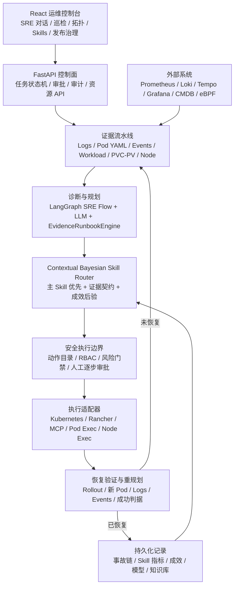

# Flawless 项目技术材料

版本：5.3.0

材料用途：技术评审、项目汇报、生产交付、运维培训

## 1. 项目定位

Flawless 是面向 Kubernetes、Rancher 和扩展基础设施的 AI 原生 SRE 控制面。它不是只输出建议的聊天机器人，而是把以下环节连接成可审计、可审批、可验证的运维闭环：

```text
发现问题 → 采集证据 → 根因诊断 → 动态匹配 Skill
        → 生成变更预览 → 人工逐步审批 → 执行变更
        → 验证新 Pod/资源状态 → 未恢复则重规划 → 经验沉淀
```

项目的核心原则是：

1. 模型负责理解证据、提出候选根因和规划建议。
2. 平台负责动作白名单、RBAC、风险门禁、人工审批、执行和回滚。
3. Kubernetes API 接受变更不等于故障恢复；必须重新读取新 Pod 状态、日志、Events 和业务恢复判据。
4. 只要没有取得明确恢复证据，故障链就保持打开并继续给出差异化方案。

## 2. 业务与技术目标

### 2.1 主要能力

- 通过 Rancher Token 纳管多集群。
- 通过 Web 上传或粘贴 kubeconfig 直接纳管 Kubernetes 集群，并支持删除。
- SRE 对话和 AI 巡检复用同一套核心诊断、Skill 路由、审批、执行和验证能力。
- 优先读取 ERROR、FATAL、PANIC、WARNING、previous/current logs，再按需补充 Pod YAML、Events、Workload、PVC/PV、节点、拓扑和 CMDB 证据。
- 动态匹配一个最高效用主 Skill；只有存在明确跨域依赖和证据门禁时才串行追加辅助 Skill。
- 支持 Deployment、StatefulSet、DaemonSet、Job、CronJob、独立 Pod，以及 ConfigMap、Secret、PV、PVC、Service、HPA、PDB 等资源变更。
- 所有有副作用的动作均需要人工逐步确认，Shell、Pod Exec、Node Exec 同样不能绕过审批。
- 记录每次事故、方案、Skill 匹配/选择/执行/成功/失败、变更回执和恢复证据。
- 提供 Skill 成功率、解决事故数和调用生命周期统计，避免把“匹配”误算成“执行”。
- 通过 CMDB、Prometheus、Loki、Tempo、Grafana、eBPF/Beyla 等数据构建拓扑和可观测上下文。

### 2.2 典型故障闭环

项目重点验证了以下两类真实 Kubernetes 故障：

- 运行时写权限故障：不仅识别 `permission denied`，也识别 `unable to open database file`、只读数据库、WAL/PID/临时文件创建失败、目录不可写等语义，并结合实时 securityContext、volumeMount 和 Workload 模板判断。
- PVC/PV 绑定故障：从 Pod Pending 状态、Events 和 YAML 中定位未绑定 PVC，再沿 Pod → PVC → PV → StorageClass/CSI 证据链生成受审批方案。

权限恢复采用渐进策略：

1. 先尝试业务容器非 root 的 UID/GID/fsGroup 对齐方案。
2. 重新发布并检查新 Pod、日志和原始故障特征。
3. 如果实时证据证明非 root 方案仍失败，生成新的审批对象。
4. 最终兜底可完整设置 `runAsUser=0`、`runAsGroup=0`、`fsGroup=0`、`supplementalGroups=[0]`、`runAsNonRoot=false`，同时同步容器级 securityContext。
5. 只有新 Pod Ready 且原错误消失后，才记录恢复成功。

## 3. 总体技术架构



### 3.1 前端层

- 技术栈：React 19、TypeScript、Vite。
- 运维任务采用轮询读取后端真实状态，不在浏览器中假推进步骤。
- 四阶段进度固定为：采集证据、根因诊断、提交变更、恢复验证。
- 逐项展示变更目标、YAML Patch/Manifest、Shell 命令、风险和回滚方式。
- 只有用户勾选并提交与动作指纹绑定的一次性审批凭据，后端才继续执行。
- 2D 拓扑使用 React Flow/Dagre，3D 拓扑使用 Three.js。

### 3.2 控制面 API

- 技术栈：Python、FastAPI、Pydantic、Uvicorn、httpx。
- 提供集群纳管、资源目录、SRE 对话、AI 巡检、运维任务、审批、Skills、模型配置、知识库、发布治理、拓扑和观测接口。
- 运维任务以同一事故 lineage 串联多轮方案，保存已尝试动作、Skill、变更指纹和失败验证结果。
- API 副本当前要求保持 1；在引入分布式执行租约前，不把进程内协程映射声明为多副本安全。

### 3.3 Agent 与规划层

- `agents/sre_graph.py`：SRE 对话诊断图和模型降级逻辑。
- `agents/remediation_engine.py`：EvidenceRunbookEngine，根据 Kubernetes 证据产生候选根因、取证步骤、动作和恢复判据。
- `backend/app/services/ops_skill_registry.py`：Skill 包加载、语义/证据/历史成效联合评分和生命周期统计。
- `backend/app/services/ops_skill_runtime.py`：把已选中的内置可执行 Skill 物化为具体变更。
- `backend/app/services/ops_execution.py`：带心跳、取消和硬超时的有界异步执行原语。
- `agents/effectiveness.py`：记录模型、Skill、方案和最终恢复效果。

### 3.4 集群与基础设施接入层

- Rancher：通过 URL、Bearer Token 和集群 ID 访问下游 Kubernetes API。
- kubeconfig：加密保存到 SQLite 注册表，支持连接探测、资源读取、Token 刷新和删除集群。
- Kubernetes Python Client：读取对象、日志和 Events，执行结构化资源变更。
- MCP：提供标准化 Kubernetes 运维工具接口。
- Node Exec：使用受限 DaemonSet/执行容器进入节点，仍受动作目录和人工审批约束。
- Cloud/Infrastructure Adapter：为数据库、虚拟机、存储、中间件和云资源提供统一扩展契约。

## 4. 智能运维核心流程

### 4.1 证据优先级

证据按成本和诊断价值渐进采集：

1. 目标 Pod 状态、current logs、previous logs。
2. ERROR/FATAL/PANIC/WARNING 和语义致命错误摘要。
3. Workload 模板、容器状态、lastState、securityContext、volumeMount。
4. Events、PVC/PV、StorageClass/CSI、节点状态。
5. Service/Endpoint、最近变更、发布信息。
6. 只有本地证据无法闭环时才扩大到 CMDB、依赖拓扑、指标、链路和 eBPF 流量。

CMDB 或可选观测系统失败不会阻塞已经由本地 Kubernetes 证据证明的修复。

### 4.2 LLM 与确定性引擎分工

LLM 接收真实证据、动作目录、匹配 Skill 摘要、历史失败指纹和上一轮恢复验证结果，返回结构化 JSON：

- 多个候选根因与置信度；
- 支持证据和反证；
- 仍需补充的区分性证据；
- 主 Skill、可选辅助 Skill 和依赖门禁；
- 一个候选动作及理由。

模型输出不能直接执行。平台随后进行：

1. JSON 结构校验。
2. 动作目录校验。
3. 目标和参数补全。
4. 风险等级和回滚策略注入。
5. 已失败动作/参数指纹去重。
6. Skill 证据契约和允许动作校验。
7. 人工审批。

当模型不可用或超时时，EvidenceRunbookEngine 继续提供确定性候选；如果模型和确定性路径都无法证明安全变更，系统会明确结束本轮诊断并保留证据缺口，不会假装成功。

### 4.3 Skill 路由算法

Skill Router 使用上下文贝叶斯效用排序，综合：

- 模型候选根因先验；
- 当前证据覆盖度；
- 症状和语义相关性；
- Skill 历史成功/失败的 Beta 后验；
- 当前故障链已失败 Skill/动作惩罚；
- 变更风险；
- 证据不确定性。

执行规则：

- 同一时刻只执行最高效用主 Skill。
- 置信度或证据不足时，只执行该 Skill 的只读取证步骤，补采后重新排序。
- 通用 CrashLoop Skill 只做分流，不能拥有写动作，也不能成为事故终态。
- 只有模型提供明确的跨域依赖、原因和 gate evidence，才串行启用辅助 Skill。
- “匹配、选中、计划、请求审批、执行、成功、失败、回滚”分别计数。

### 4.4 防卡死状态机

5.0.0 将根因诊断拆成独立可观测阶段：

```text
root_cause_diagnosing
  → llm_planning
  → llm_planning_done / llm_planning_failed
  → skill_router_processing
  → skill_router_done / skill_router_timeout / skill_router_failed
  → root_cause_diagnosed
  → diagnosis_done
```

关键工程措施：

- LLM 在线程中调用并受独立硬超时约束。
- Skill Router 的同步注册表和指标存储也放入独立线程，默认 18 秒硬超时。
- 无 LLM 的确定性重规划默认 20 秒硬超时。
- 外层根因诊断预算至少覆盖 LLM、Router 和收尾时间。
- 进度落库自身最多等待 1 秒，不能反向阻塞修复。
- 后台协程异常退出必须写入终态。
- 查询到“任务仍运行但执行协程已丢失”时，自动废除旧审批并从实时证据恢复。
- 前端不再把缺失的计时字段错误显示成“已用 0 秒、剩余 0 秒”。

## 5. 安全与审批设计

### 5.1 模型不可越过的边界

- 只允许动作目录中注册的动作。
- 命名空间和资源范围受 RBAC、Allowlist 和目标发现约束。
- 所有 Kubernetes 写操作、Shell、Pod Exec、Node Exec 必须人工逐项审批。
- 每次审批绑定 `approval_id + change_fingerprint + change_index`，一次性消费。
- 新证据导致动作变化时，旧审批自动失效。
- API/RBAC/证书/网络执行通道失败不会被误判为业务恢复。
- 日志、审计和 API 响应执行统一敏感字段脱敏。

### 5.2 回滚与验证

- 每个动作必须携带回滚说明；支持的动作可带结构化回滚 Patch。
- 变更后等待 rollout，重新定位替换 Pod。
- 验证 Ready、重启次数、终止原因、日志错误、Events 和原始成功判据。
- 仅当 `verification.recovered=true` 时，事故状态才能进入 `completed`。
- 未恢复时保存 `_last_failure` 和动作指纹，禁止只改写理由后重复同一无效方案。

### 5.3 灰度发布的 SRE 落地

5.0.0 把原有“展示灰度策略、一次性 patch Deployment”升级为真实 Argo Rollouts canary：

1. 现有 BFS 依赖图算法计算故障域、可达节点、关键依赖和 blast radius。
2. 发布风险算法根据错误预算、近期异常、依赖影响面和变更通道选择首批比例、增长步长、最大比例和观察窗口。
3. 副本离散化算法计算一个 Pod 对应的真实最小权重；若超过批准上限则阻断，不隐式扩大爆炸半径。
4. Argo 在每个 `setWeight` 后运行一次 AnalysisRun，实时回调 Flawless 查询 SLO 状态和 Prometheus 错误率/P99。
5. 指标缺失是 inconclusive，硬性阈值违规是 failed；二者都不能继续扩大。
6. 达到算法上限后无限暂停，必须由操作员二次批准 `promoteFull`。
7. 失败时先恢复 stableRS，再从该 ReplicaSet 恢复源 Deployment template；运行态和声明态同时恢复才关闭回滚链。

这套设计体现了 SRE 的错误预算门禁、渐进式交付、最小爆炸半径、自动回退、人工高风险审批和可验证恢复，而不只是 Kubernetes RollingUpdate。

### 5.4 权限故障的恢复与合规分层

`runAsUser/runAsGroup/fsGroup=0` 是业务恢复手段，不是长期安全基线。权限 Skill 按以下边界执行：

1. 先证明错误路径、volumeMount、运行 UID/GID 与 ERROR/WARNING 日志属于同一故障链；数据库打开失败等应用包装错误本身不能直接授权 root。
2. 优先使用镜像声明的业务 UID/GID、`fsGroup`、`supplementalGroups` 或存储侧属主/ACL，使容器继续以非 root 运行。
3. 完整非 root 方案已实际发布且新 Pod 仍报告同一错误时，才展示完整 root 补丁；该步骤必须重新人工审批，不能复用上一阶段审批。
4. root 方案同时保持 `allowPrivilegeEscalation=false`，保存变更前快照并限制在单个 Workload；成功后记录残余风险，另行提出可回滚的非 root 加固计划。
5. 若 root 后仍失败，禁止重复同值 Patch；系统转向 `readOnly`、NFS `root_squash`、CSI 权限、容量、I/O、数据库损坏或后端目录 ACL，并明确要求对应存储管理员处理。

扩展到全量集群风险时，不使用“统一改 root”的自动化规则。OOM、探针、镜像、ConfigMap/Secret、PVC/PV、网络、节点压力和发布失败分别由证据最匹配的 Skill 负责；每个 Skill 都受目标范围、爆炸半径、动作白名单、逐项审批、回滚和恢复判据约束。扫描发现风险只会创建待处置事故，不会自动获得写权限。

## 6. 数据与持久化

| 数据 | 默认生产路径 | 用途 |
|---|---|---|
| 集群注册表 | `/var/lib/flawless/clusters.db` | 加密 kubeconfig、连接状态 |
| 运维任务 | `/var/lib/flawless/ops-jobs.json` | 事故链、事件、计划、审批状态 |
| Skills | `/var/lib/flawless/ops-skills/` | 标准 Skill 包与引用资料 |
| Skill 指标 | Skill 根目录下 `_usage.json` | 生命周期计数、事故解决率 |
| 运维成效 | `/var/lib/flawless/effectiveness-state.json` | 模型/Skill/方案恢复效果 |
| 可靠性状态 | `/var/lib/flawless/reliability-state.json` | SLO、错误预算、发布治理 |
| 模型配置 | `/var/lib/flawless/model-profiles.json` | 多模型 Profile 和路由 |
| 知识库 | `/var/lib/flawless/knowledge-base.json` | 上传材料与运维知识 |

生产部署需要把 `/var/lib/flawless` 挂载到可写 PVC。集群凭据、模型密钥、Rancher Token 和加密密钥应使用 Kubernetes Secret，不应写入 ConfigMap 或代码仓库。

## 7. 工程实现

### 7.1 主要技术栈

| 层次 | 技术 |
|---|---|
| Web | React 19、TypeScript、Vite、React Flow、Dagre、Three.js |
| API | Python 3.11+、FastAPI、Pydantic、Uvicorn、httpx |
| Agent/LLM | LangGraph、LangChain、OpenAI-compatible API、OAuth Client Credentials |
| Kubernetes | Kubernetes Python Client、kubectl、Rancher API、MCP |
| 数据 | SQLite、JSON 原子文件、Fernet 加密 |
| 可观测 | Prometheus、Loki、Tempo、Grafana、Langfuse、eBPF/Beyla |
| 交付 | Docker 多阶段构建、Docker Compose、Helm、Kubernetes YAML |
| 测试 | pytest/unittest、真实 Kind/K3s、httpx、kubectl、TypeScript Compiler、Vite |

### 7.2 代码结构

```text
agents/                  SRE 图、LLM 客户端、修复引擎、成效记录
backend/app/             控制面 API、状态机、Schema、领域和服务
backend/app/services/    集群注册、Skill、证据、执行、资源和可靠性服务
mcp_servers/             Kubernetes MCP Server
cmdb/                    本地 CMDB 与拓扑服务
cloud/                   基础设施适配器接口
frontend/modern/         React 运维控制台
charts/flawless/         生产 Helm Chart
manifests/               原生 Kubernetes 部署清单
scripts/                 构建、镜像同步、Linux/Windows 部署工具
tests/                   单元、状态机和真实 Kubernetes E2E
```

### 7.3 镜像与运行形态

- 主镜像使用 Docker 多阶段构建：Node 阶段编译前端，Python 阶段安装带哈希锁定的依赖并打包后端与全部 Agent。
- 默认运行用户为非 root `10001:10001`。
- 生产 Helm/YAML 可在一个 Pod 内启动 API、观测、Healing、Incident、Postmortem、Adapter 和 MCP 容器，共享运行时存储。
- Node Exec 使用独立镜像和单独的受控权限边界。
- 国内网络可通过镜像代理和自定义 npm/PyPI/Debian 源完成构建及拉取。

## 8. 本次版本验证证据

5.3.0 已完成：

- Python 全量测试：229 passed + 25 subtests（含 11 个常见 Kubernetes 可执行 Skill 的统一执行契约矩阵）；标准库 unittest 门禁为 229 tests。
- 前端生产构建：TypeScript 校验和 Vite build 通过。
- 新增 `ResumableSREHarness/v1`：阶段检查点、工具/变更回执、重复轨迹停滞检测和确定性完成判定均随 OpsJob 持久化；模型不能自行把任务标记为恢复。
- HTTP 并发门禁改为排队而不是 1.5 秒后返回“运维过载”；任务创建、状态读取、逐项审批和中断属于优先控制链路，不会被看板或慢清单请求饿死。
- Beyla 与 Alloy 均按兼容 Linux 节点全覆盖调度并容忍所有污点；Alloy 写入 cluster/node Loki 标签，拓扑页分别展示采集器覆盖率和当前窗口真实 flow 节点，缺失节点可直接定位；Loki 无数据时还会经 Rancher/kubeconfig 对每个 collector Pod 做限时只读日志兜底，不再把转发链故障误报成没有 eBPF。
- 常见 Kubernetes 故障已从“Skill 名称匹配”升级为 12 个版本化服务端执行器：卷/SQLite 写权限、PVC/PV、OOM、探针慢启动、镜像鉴权与架构、ConfigMap 引用、Service/Endpoint、发布回归、节点压力、PDB 死锁、CPU 容量和 DNS/CNI；调度/配额/准入与证书/Webhook 使用独立高风险 Skill，在没有批准目标值、Secret 或 PKI 制品时只诊断不编造变更。
- 运维并发改为实际 Kubernetes 写入租约：证据采集和人工审批等待不占执行槽，超过全局写入上限的任务进入队列，同一资源保持 single-flight，消除遗留审批任务导致的“自动运维并发达到保护阈值”。
- 3D 拓扑新增默认自动环绕、暂停/恢复控制、实时状态标识和深色星空层次；本地模拟 6 节点/6 条关系边验证了 Three.js 渲染和持续旋转，浏览器控制台无 warning/error。
- 运维成效默认仅展示 `verification.recovered=true` 的已解决问题，摘要直接显示问题数、恢复 Workload 和恢复 Pod。
- 单条记录可展开根因、匹配 Skill、最终策略、审批后变更、差异化换路历史和恢复验证证据；失败或只读诊断不再混入成效清单。
- 真实 DeepSeek 路径：11.32 秒完成 `llm_planning → llm_planning_done → skill_router_processing → skill_router_done`，模型来源为 `llm+EvidenceRunbookEngine`。
- Skill Router 卡死模拟：LLM 返回后 Router 人为阻塞，任务在独立硬超时内产生 `skill_router_timeout` 并安全返回。
- 孤儿任务模拟：运行状态存在但执行协程丢失时，查询触发从新证据恢复并废除旧审批。
- 真实 Kind Kubernetes 权限故障闭环（SQLite 文件打开失败、mkdir 权限拒绝、GID 不匹配三种场景）：
  - 创建非 root securityContext 导致文件和 SQLite 数据库创建失败的 CrashLoop Pod；
  - 产品通过公开 API 采集真实 Kubernetes 证据；
  - 动态匹配权限恢复 Skill；
  - 两次独立人工审批；
  - 第一次非 root 方案验证失败后自动升级为单独审批的完整 root 方案；
  - 同一阶段已被 API 接受后立即记录，不再因同进程重规划而重复提交同值 Patch；
  - 实际 Patch Deployment 并滚动生成新 Pod；
  - 旧 Pod 被 ReplicaSet 删除后，自动按 Workload owner 重定位新 Pod，记录 Pod lineage 并续采日志；
  - 恢复验证仅判定最新 controller revision，旧 CrashLoop Pod 不再永久否决已收敛的新 ReplicaSet；
  - 新 Pod Ready 后使用有界的 Pod/日志/Workload 证据，不再重新执行整套慢速深度取证；
  - 新 Pod Ready，原错误消失，最终 `completed/recovered=true`；
  - root 仍失败时不重复 Patch，转为只读卷、NFS `root_squash`、CSI、容量或存储后端的显式管理员边界。
- kubeconfig 脱离 Rancher 闭环：通过 `/api/clusters` 加密纳管真实 K3s，完整执行 LLM 诊断、Skill 匹配、两次审批、Deployment Patch、滚动更新和恢复验证。
- 双入口纳管兼容性：页面可选择 Rancher URL/Token 或 kubeconfig；已有 ConfigMap/Secret Rancher 配置在仅替换镜像时保持默认生效，页面新配置验证成功后才加密覆盖，删除覆盖后自动回退。
- 状态感知日志证据：容器尚未启动时不再把 Kubernetes log HTTP 400 当作终点，保留 waiting reason/message，并在 Workload 范围内补采证据优先级最高的异常 Pod current/previous 日志。
- eBPF/Beyla 拓扑：兼容 `namespace/pod/container` 与 `namespace_name/pod_name/container_name` 标签、纯文本与 JSON 包装 flow 日志；CMDB 降级时仍融合真实观测边。
- 信息架构：核心入口收敛为 SRE 对话、AI 巡检、拓扑影响、Skill 库；运行总览、资源事件和运维成效归入平台能力。

## 9. 项目过程中使用的工具

### 9.1 需求与设计

- PowerPoint：作为原始业务目标、页面效果和功能闭环基线。
- Mermaid：整理控制面、证据流、审批和恢复验证架构。
- Codex：代码库分析、跨模块实现、测试编排、问题定位和技术材料整理。

### 9.2 开发与调试

- Git、GitHub：版本控制、历史脱敏、发布和公共仓库交付。
- ripgrep：跨仓库定位调用链、环境变量、镜像和敏感字段。
- Python、pytest/unittest：后端、算法、状态机和异常分支测试。
- npm、TypeScript Compiler、Vite：前端类型检查和生产构建。
- Docker：多阶段镜像构建、运行环境和离线镜像验证。
- Kubernetes/kubectl、K3s：真实 Workload 故障注入、Patch、rollout 和恢复证明。
- httpx/curl：API、模型网关和健康检查。
- DeepSeek OpenAI-compatible API：真实结构化根因规划与 Skill 路由输入验证。

### 9.3 生产与交付

- Helm 和原生 YAML：集群部署与配置覆盖。
- Docker Registry/GHCR 及国内代理：公共镜像发布和公司私有仓库同步。
- Kubernetes Secret：模型凭据、Rancher Token、集群加密密钥和第三方凭据。
- Prometheus、Loki、Tempo、Grafana、Langfuse：指标、日志、链路和模型调用观测。

## 10. 可用于汇报或答辩的材料清单

建议按以下顺序组织汇报：

1. 一页项目背景：传统告警、聊天建议和脚本自动化为什么不能证明恢复。
2. 一页目标：可纳管、可诊断、可审批、可执行、可验证、可沉淀。
3. 一页总体技术架构图。
4. 一页 AgenticOps 状态机和安全边界。
5. 一页证据优先级与智能根因诊断。
6. 一页 Skill 动态路由算法和一主多辅规则。
7. 一页权限故障案例：日志 → YAML → Skill → 两次审批 → Deployment Patch → 新 Pod 恢复。
8. 一页 PVC/PV 案例：Pending/Event → PVC → PV/StorageClass/CSI → 变更与验证。
9. 一页记录与指标：事故 lineage、Skill 生命周期、成功率、解决数。
10. 一页工程实现：技术栈、代码结构、镜像和部署形态。
11. 一页安全设计：RBAC、Secret、动作目录、审批指纹、回滚。
12. 一页测试结果和真实 Kubernetes 证据。
13. 一页生产部署与后续演进路线。

### 10.1 推荐演示脚本

1. 打开一个因 securityContext 不匹配而 CrashLoop 的 Deployment。
2. 在 SRE 对话或巡检中发起深度分析。
3. 展示 ERROR/WARNING、Pod YAML、Workload 和存储证据。
4. 展示 LLM 已返回、Skill Router 已完成和主 Skill。
5. 核对第一轮非 root Patch 并人工批准。
6. 展示新 Pod 仍失败，平台没有宣称成功。
7. 展示差异化 root 兜底 Patch，并进行第二次独立审批。
8. 展示 Deployment 的真实 generation/ReplicaSet 变化。
9. 展示新 Pod Ready、成功日志和 `verification.recovered=true`。
10. 打开 Records/Skills 页面，查看同一事故链和 Skill 成效统计。

## 11. 后续演进建议

- 引入分布式任务租约和队列后再支持 API 多副本执行。
- 将 JSON 状态逐步迁移到事务型数据库，同时保留可导出的 Skill 包。
- 为不同 CSI、数据库、虚拟机和中间件增加更多经过真实 E2E 验证的可执行 Skill。
- 增加基于事故回放集的模型/Skill 离线评测和发布门禁。
- 将 eBPF 流量、Service/Endpoint 和 CMDB 关系做持续一致性校验。
- 对高风险 root 兜底建立按命名空间、镜像和业务等级分层的策略审批。
