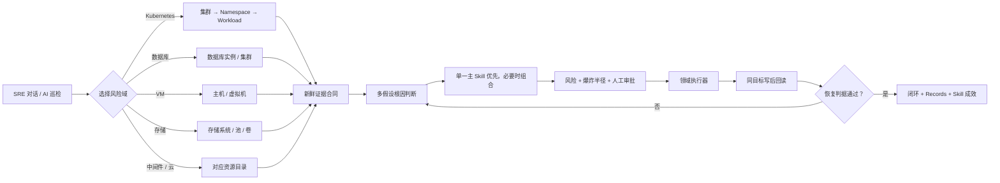
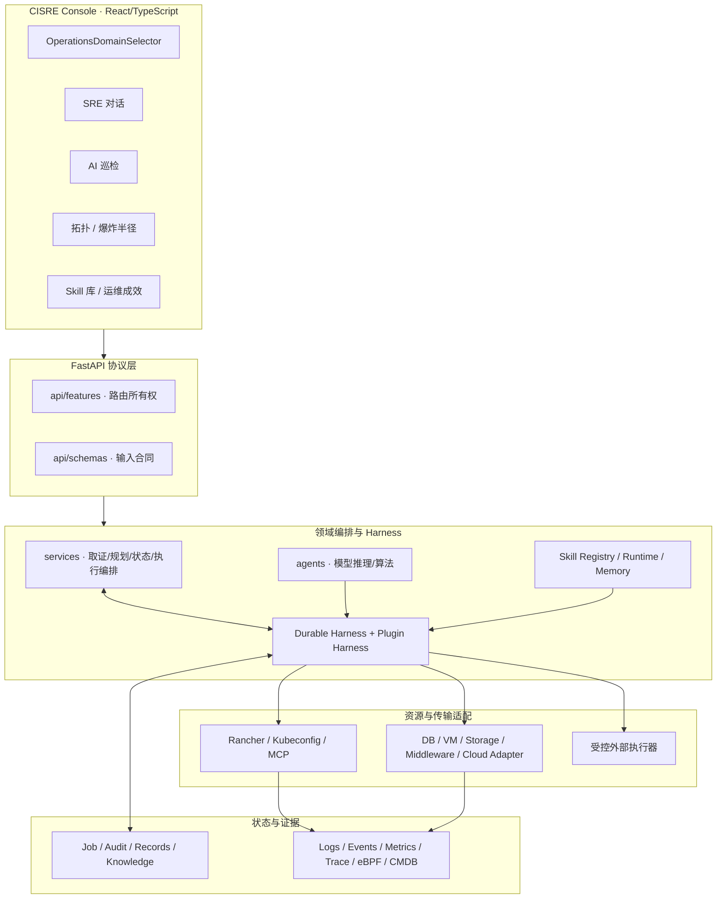

# CISRE 代码架构、团队协作与扩展接入指南

本文是 CISRE 的团队开发基线。目标是让 Kubernetes、数据库、VM、存储、中间件和云平台团队能够并行开发，也让 AI/Vibe Coding 工具在不知道全部历史的情况下，通过稳定合同完成局部修改而不破坏生产闭环。

## 1. 当前能力边界

| 运维域 | 当前状态 | 已有能力 | 产品连接器工作 |
|---|---|---|---|
| Kubernetes | 内置完整能力 | Rancher / Kubeconfig / ServiceAccount 纳管，证据、Skill、审批、写后回读、Rollout/新 Pod/日志验证 | 持续增加 Skill 与回归场景 |
| 数据库 | 扩展合同就绪 | 统一入口、库存、发现、巡检、Skill、OpsJob、审批、外部执行器、验证合同 | 各数据库团队实现只读 Adapter 和批准动作执行器 |
| VM / 主机 | 扩展合同就绪 | 同上 | OS/虚拟化团队接 Agent、云管、堡垒机或 AWX |
| 企业存储 | 扩展合同就绪 | 同上 | 存储团队接阵列、CSI、NFS/SAN/Ceph API |
| 中间件 | 扩展合同就绪 | 同上 | 中间件团队按产品实现 Adapter |
| 云资源 | 扩展合同就绪 | 同上 | 云平台团队接工作负载身份、云监控和云管执行器 |

“合同就绪”不是“厂商已经连接”。UI 会显示资源数和 Adapter 状态，不会伪造健康数据。

## 2. 用户入口与统一闭环

SRE 对话和 AI 巡检进入时，先选择要解决的基础设施风险域。选择 Kubernetes 后进入现有集群/Namespace/Workload 流程；选择数据库、VM、存储等域后进入对应资源工作台。顶部下拉可随时切换域。



所有域共用同一完成语义：模型说“完成”、执行 API 返回 2xx、旧实例仍健康，都不能证明恢复。只有对真实目标重新取证并满足恢复判据，任务才能闭环。

## 3. 系统分层



核心原则：**模型负责理解和建议，Harness 负责状态和门禁，Adapter 负责事实，Executor 负责受控副作用，Verifier 负责证明恢复。**

## 4. 代码目录与所有权

```text
repository/
├── AGENTS.md                         # 人和 AI 编码代理必须遵守的仓库规则
├── backend/app/
│   ├── main.py                       # 兼容启动入口，不放业务逻辑
│   ├── application.py                # 旧组合根；只迁出，不继续堆 Provider 分支
│   ├── api/
│   │   ├── features/                 # 按能力声明路由
│   │   ├── schemas/                  # Pydantic 请求/响应合同
│   │   └── reliability.py            # 可靠性 API 的依赖注入边界
│   ├── services/
│   │   ├── cluster_registry.py       # Rancher/Kubeconfig 集群纳管
│   │   ├── ops_harness.py            # 持久状态机和唯一完成语义
│   │   ├── harness_plugins.py        # 可插拔 Planner/Skill/Gate/Executor/Verifier
│   │   ├── ops_execution.py          # 执行编排与防并发重复
│   │   ├── ops_skill_*.py            # Skill 注册、运行、统计
│   │   ├── infrastructure_providers.py # 兼容库存/外部 Adapter 编排
│   │   ├── progressive_delivery.py   # SRE 发布治理
│   │   ├── ebpf_flows.py             # 流数据归一化
│   │   └── reliability_store.py      # SLO/记录/状态持久化
│   └── adapters/
│       ├── contracts.py              # v1 强类型资源/证据/验证合同
│       ├── registry.py               # 进程内 Adapter 注册表
│       ├── domains.py                # 风险域目录
│       ├── database/                 # 数据库团队目录
│       ├── virtual_machine/          # OS/虚拟化团队目录
│       ├── storage/                  # 存储团队目录
│       ├── middleware/               # 中间件团队目录
│       └── cloud_service/            # 云平台团队目录
├── agents/                            # 模型调用、诊断、算法；不持有写权限
├── mcp_servers/                       # Kubernetes 类型化读写工具与白名单
├── frontend/modern/src/
│   ├── main.tsx                       # 应用装配与顶级导航
│   ├── UnifiedPages.tsx               # 共享能力页面
│   ├── components/OperationsDomainSelector.tsx
│   ├── components/OpsPlanPanel.tsx
│   └── lib/api.ts                     # 前端 API 边界
├── manifests/                         # 原生 Kubernetes 部署
├── charts/                             # Helm 发布
├── deploy/                             # 可选控制器/依赖组件
├── tests/                              # 合同、单元、回归和 E2E
├── scripts/                            # 构建、部署、故障注入与检查
└── docs/                               # 架构、部署和开发文档
```

### 4.1 不应继续扩大的部分

`backend/app/application.py` 是历史兼容组合根，保留它是为了不改变生产启动命令和旧测试补丁点。新增能力应按以下顺序落位：

1. 在 `schemas/` 定义输入输出；
2. 在 `services/` 或 `adapters/<domain>/` 实现；
3. 在 `api/features/` 注册路由；
4. 只在组合根完成最小依赖装配；
5. 为接口和失败路径增加合同测试。

禁止再向组合根加入某厂商的 SDK 调用、SQL、SSH、字段分支或大段业务算法。

## 5. Kubernetes 现有闭环（不可破坏）

```text
选择集群/Namespace/Workload
  -> 当前 Pod 状态；当前日志优先，取不到才读 --previous
  -> Events + Workload 实时 YAML + 存储/依赖证据
  -> LLM 多假设判断 + Skill Router
  -> 最小非 root 方案；失败且证据支持时才升级 root 等下一策略
  -> 每项人工审批
  -> Rancher / Kubeconfig / MCP 在真实目标执行
  -> 同通道读取 UID/resourceVersion/generation 和补丁字段
  -> 等待新 ReplicaSet/Pod
  -> 验证新 Pod Ready、重启稳定、错误消失、业务探针
  -> 未恢复则换策略；恢复才写入 Records
```

传输必须始终使用任务绑定的 `cluster_id`。写后回读必须使用与变更相同的通道，不能变更走 Rancher、验证走本地集群。

## 6. 非 Kubernetes Adapter 合同

权威实现与示例见 [`backend/app/adapters/README.md`](../backend/app/adapters/README.md)。机器可读合同：

```http
GET /api/infrastructure/contracts
GET /api/operations/domains
```

协议版本：

| 合同 | 版本 | 含义 |
|---|---|---|
| Adapter | `cisre.infrastructure.adapter/v1` | Adapter 身份、领域、能力和只读约束 |
| Resource | `cisre.infrastructure.resource/v1` | 统一资产身份与非敏感事实 |
| Evidence | `cisre.infrastructure.evidence/v1` | 有时间戳的信号、指标、事件、依赖和采集错误 |
| Verification | `cisre.infrastructure.verification/v1` | 真实回读后的逐项恢复判据 |

### 6.1 领域证据与恢复合同

| 领域 | 至少采集 | 至少验证 |
|---|---|---|
| 数据库 | 连通性、角色、连接/会话、慢 SQL、锁、复制、容量、备份、最近变更 | 连通性、复制/锁/容量对应指标、业务读写探针、错误率 |
| VM | Agent、CPU/内存、磁盘/inode、服务、网络、系统日志、基线、最近变更 | Agent 在线、服务健康、压力解除、业务探针、错误率 |
| 存储 | 系统/池/卷/路径、容量、时延/IOPS、ACL、快照、复制、最近变更 | 路径/卷在线、容量安全、时延恢复、消费端挂载、业务探针 |
| 中间件 | 集群健康、积压、客户端错误、容量、最近变更 | 集群健康、积压恢复、生产/消费业务探针 |
| 云资源 | 状态、配额、网络策略、监控、最近变更 | 资源健康、配额安全、网络/业务探针 |

### 6.2 接入方式 A：CMDB/资产平台推送

适合先完成资源纳管，不要求把厂商 SDK 装进 CISRE。

```http
POST /api/infrastructure/resources/sync
Content-Type: application/json

{
  "provider": "enterprise-cmdb",
  "source": "daily-sync",
  "replace": false,
  "resources": [
    {
      "id": "db-prod-01",
      "type": "database",
      "subtype": "mysql",
      "name": "order-db-primary",
      "environment": "production",
      "business_service": "order",
      "criticality": "high",
      "host": "db.example.com",
      "port": 3306,
      "metrics": {"connections_percent": 82}
    }
  ]
}
```

请求不得包含密码、Token、API Key、私钥或可还原的 DSN 凭据。

### 6.3 接入方式 B：独立 HTTP Adapter

适合各领域团队独立部署、独立升级。在服务端 ConfigMap 中登记白名单：

```json
[
  {
    "id": "database-platform",
    "provider": "enterprise-dba-platform",
    "display_name": "Database Platform",
    "resource_types": ["database"],
    "regions": ["region-a"],
    "discovery_url": "https://adapter.example.com/v1/discover",
    "auth_env": "DATABASE_ADAPTER_TOKEN",
    "enabled": true
  }
]
```

CISRE 调用 Adapter 的请求：

```json
{
  "contract_version": "cisre.infrastructure.discovery/v1",
  "adapter_id": "database-platform",
  "account_ref": "production",
  "resource_types": ["database"],
  "regions": ["region-a"],
  "read_only": true
}
```

`auth_env` 指向 Secret 注入的环境变量；浏览器和调用请求都不携带凭据。

### 6.4 接入方式 C：进程内 Python Adapter

实现 `ReadOnlyInfrastructureAdapter` 的 `discover`、`collect_evidence`、`verify`，并由组合根显式注册。强类型注册表会拒绝写能力、错误类型和包含敏感字段的事实。它适合依赖较小的只读连接器，不适合加载冲突严重或高权限的厂商 SDK。

## 7. 统一变更执行器合同

非 K8s Adapter 没有写方法。批准后的动作由 `INFRASTRUCTURE_ACTION_WEBHOOK_URL` 接收：

```json
{
  "action": "db_apply_parameter",
  "resource": {
    "id": "db-prod-01",
    "type": "database",
    "name": "order-db-primary",
    "provider": "enterprise-dba-platform"
  },
  "parameters": {"approved_profile_id": "db-profile-17"},
  "reason": "连接数持续超过安全阈值，证据指向参数不足",
  "risk": "high",
  "rollback": "恢复审批前参数快照",
  "operator": "authenticated-operator",
  "plan_id": "ops-job-id",
  "evidence": {"connections_percent": 94},
  "confirmation": {"human_confirmed": true, "stepwise_confirmation": true}
}
```

执行器返回：

```json
{
  "status": "completed",
  "audit_id": "change-ticket-id",
  "executor": "dba-platform",
  "message": "Approved action completed",
  "evidence": {"target_version": "configuration-revision"},
  "rollback_hint": "restore configuration snapshot"
}
```

执行器只能接受动作目录中的 ID 和结构化参数，不能接受任意 SQL/Shell。回执只是“动作完成”的证据；CISRE 仍需调用 Adapter 重新取证，才能判断“故障恢复”。

## 8. 稳定 API 清单

| API | 用途 | 兼容性 |
|---|---|---|
| `GET /api/operations/domains` | 前端风险域菜单、资源数、接入状态 | v1 可加可选字段 |
| `GET /api/infrastructure/contracts` | Adapter 机器可读合同 | 版本化 |
| `GET /api/infrastructure/providers` | 资源类型、Provider、Adapter 与配置摘要 | 旧客户端兼容 |
| `GET /api/infrastructure/resources?resource_type=...` | 查询非 K8s 资源 | 旧客户端兼容 |
| `POST /api/infrastructure/resources/sync` | 推送非敏感资产 | 最大 5000 条/次 |
| `POST /api/infrastructure/discover` | 调用服务端配置的只读发现 Adapter | URL/凭据不可由请求指定 |
| `POST /api/infrastructure/scan` | 只读探测、Finding、Skill 与预演 | 不直接执行变更 |
| `POST /api/ops/jobs` | 建立持久运维任务 | 所有域共用 |
| `POST /api/ops/jobs/{id}/approve-step` | 逐项批准 | 旧批准不可复用于变化后的补丁 |
| `POST /api/ops/jobs/{id}/cancel` | 人工中断 | 审计保留 |

兼容规则：v1 中只能新增可选字段；不能重命名字段、改变默认值语义、放宽审批或重新解释 `completed/recovered`。破坏性变更并行新增 `/v2`，v1 至少保留一个完整发布线。

## 9. 团队并行开发边界

| 团队 | 可独立修改 | 需要核心组评审 |
|---|---|---|
| K8s SRE | Kubernetes Skill、证据解析、K8s E2E | action catalog、审批、完成语义、传输合同 |
| 数据库 | `adapters/database/`、DB Skill、DB 测试/文档 | 新动作 ID、执行器合同、公共 Resource 字段 |
| VM/OS | `adapters/virtual_machine/`、VM Skill、VM 测试/文档 | Shell 动作、主机高权限、重启/快照风险策略 |
| 存储 | `adapters/storage/`、Storage Skill、测试/文档 | 删除/恢复/切换等高风险动作 |
| 中间件 | `adapters/middleware/`、产品 Skill | 公共合同和跨域依赖语义 |
| 云平台 | `adapters/cloud_service/`、云资源 Skill | 身份、配额、安全组和高风险动作 |
| 前端 | 风险域工作台和领域组件 | 顶级路由、OpsJob 状态语义、审批交互 |
| 平台核心 | Harness、合同、执行、验证、记录、版本 | — |

领域团队的 PR 不应同时重构 Harness、顶级导航和另一个领域 Adapter。跨域能力先写设计记录，再拆成可独立合并的合同、后端、前端和连接器 PR。

## 10. AI / Vibe Coding 安全工作流

仓库根目录 `AGENTS.md` 是给 Codex、Claude Code 等编码代理的最小上下文。每次任务应明确“领域、合同版本、允许修改目录、验收测试”，推荐提示词：

```text
在 CISRE 仓库为 <产品> 增加只读 <domain> Adapter。
先阅读 AGENTS.md、TEAM_ARCHITECTURE_AND_EXTENSION_GUIDE_ZH.md 和对应 Adapter README。
只修改 backend/app/adapters/<domain>/、对应 tests 和 docs；不得修改审批、执行和完成语义。
实现 discover/collect_evidence/verify，凭据只能用 Secret 引用。
添加成功、超时、脱敏、返回类型和恢复失败测试，最后运行完整 pytest。
```

编码代理不得自行做以下决定：

- 绕过人工审批或把高风险动作改成自动执行；
- 把 Adapter 变成可写连接器；
- 根据 API 2xx 宣布恢复；
- 把 SQL/Shell/URL 直接交给模型执行；
- 改变 v1 字段含义、删除旧环境变量或迁移生产持久化路径；
- 在代码、文档、测试中写真实内网信息和密钥；
- 覆盖其他人的未提交修改。

## 11. 新 Adapter 的 Definition of Done

每个连接器只有满足以下条件才算完成：

- 资源 ID 稳定，重复发现不会产生重复资产；
- `discover` 只读且支持超时、分页、限流和部分失败；
- `collect_evidence` 有采集时间、来源、单位、错误和新鲜度；
- Evidence 不包含凭据，错误消息经过脱敏；
- Skill 声明所需证据、允许动作、风险、回滚和恢复判据；
- 所有写动作进入 OpsJob 和逐项人工审批；
- 执行器具备幂等键、审计 ID、超时和回滚提示；
- `verify` 重新读取真实目标，能区分成功、失败和未知；
- Records 能展示问题、目标、Skill、动作、审批人、耗时和验证证据；
- 单元/合同/超时/脱敏/失败/E2E 测试通过；
- `python -m pytest tests` 与前端 `npm run build` 通过；
- 文档和示例不包含组织内部信息。

## 12. 推荐演进顺序

1. 数据库团队先通过库存同步纳管资产，再实现一个只读数据库 Adapter 和 3 个高频 Skill（连接耗尽、复制延迟、锁等待）。
2. VM 团队接企业 Agent 或云管平台，先覆盖磁盘满、服务退出、CPU/内存压力。
3. 存储团队先接容量/路径/时延，再增加扩容、ACL、快照类批准动作与消费端验证。
4. 各域稳定后，把通用 `infrastructure_providers.py` 中对应兼容逻辑逐步迁移到独立 Adapter；迁移期间保持旧 API 与环境变量可用。
5. 最后为跨域故障增加编排 Skill，例如“数据库慢源于存储时延”或“VM 故障影响 K8s 外部依赖”，但仍按阶段审批，避免扩大爆炸半径。

这条路线允许团队今天开始分工，也不要求一次性重写现有 Kubernetes 生产链路。
